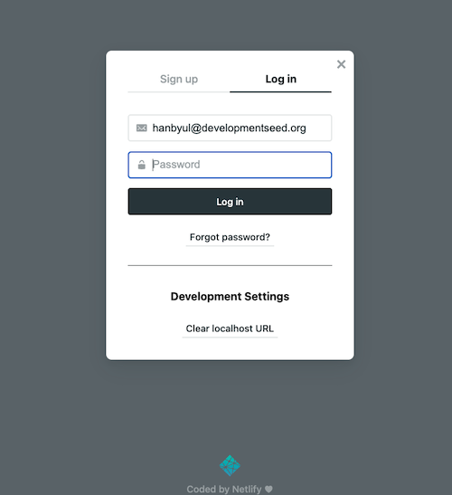

## How to use Netlify CMS with Veda dashboard

### Sign up

You can access to Veda dashboard configuration editor at https://visex.netlify.app/admin/index.html . You should be able to see a prompt like the one below if it is your first time.

Follow the steps on the page to sign up as a user for CMS.

### Configure dataset 

### 'Save' with preview

Once you 'save' your post through a toolbar, cofiguration editor will show 'Check for preview' button on the top right corner of the page.

The button will change its text to 'View preview' once the preview is ready as you click upon it. You can click on the button to see your change on preview page.

#### Behind the scene

When the post is saved, PR with the new change is generated to staging branch automatically by Netlify. You can treat it like other PRs.

### Where can I find the post that I (or my collaborator) saved?

On main dashboard view, you will find 'workflow' tab on top left.

You can find the posts generated through Netlify CMS on this page. 

### Publish 
you can merge the PR, or hit 'publish' button through the editor UI. We recommend using the first method since the current version of CMS still requires manual edits. 

### Caveats

Some manual edits to mdx file are needed after the file is generated through Netlify CMS.

- `media.src` : `::file` need to be put as prefix for the path.
- `legend.color` for `categorical` type legend : Current CMS UI only supports `gradient` type legend. So if you use categorical legend, you need to edit mdx directly.